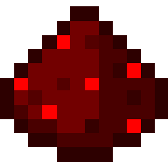

# redstone-index

<div align="center"></div>

<div align="center"><span style="display: block; margin: 20px auto; width: 400px">A website to publish and share Redstone builds.</span></div>


## Development

Get started with local development:
```bash
# Install NPM packages
npm install

# Start local Supabase instance (make sure Docker daemon is running)
npx supabase start

# Run local development server
npm run dev
```

Recommended way to make migrations:
```bash
# Create a migration file
npx supabase migration new <name>

# ...Edit migration file manually...
# For inspiration, edit the local instance via the dashboard and view:
# - `npx supabase db --schema <schema>`
# - Definitions in the Supabase dashboard

# Reset the local database with current migrations
npx supabase db reset

# Generate new type defintions for typescript in the front-end
npx supabase gen types typescript --local > types.gen.ts
```

## Deployment

Get started by linking a Supabase project:
```bash
npx supabase link --project-ref <project-id>
```

Then configure the deployment environments:
1. Supabase Vault Secrets:
  * ~~PROJECT_URL (for storage bucket handling inside SQL)~~
  * ~~SERVICE_ROLE_KEY (for storage bucket handling inside SQL)~~
2. Cloudflare Pages Environment Variables:
  * NODE_VERSION=16
  * PUBLIC_SUPABASE_ANON_KEY
  * PUBLIC_SUPABASE_URL
  * PUBLIC_ENVIRONMENT_NAME

To deploy, make a commit to `develop` (staging) or `main` (production).
* The back-end migrations are automatically pushed to Supabase via GitHub actions.
* The front-end is automatically deployed to CloudFlare pages.

## Command Cheat-sheet

### SvelteKit

| Command         | Purpose                        |
| --------------- | ------------------------------ |
| `npm run dev`   | Run local development server   |
| `npm run build` | Build front-end for production |

Front-end is automatically built and deployed to CloudFlare pages after each commit.

### Supabase

| Command                                                    | Purpose                                            |
| ---------------------------------------------------------- | -------------------------------------------------- |
| Local Development:                                         |                                                    |
| `npx supabase start`                                       | Start Supabase containers                          |
| `npx supabase stop`                                        | Stop Supabase containers                           |
| `npx supabase db reset`                                    | Reset local database to local migration scripts    |
| Managing Local Migrations:                                 |                                                    |
| `npx supabase db diff -f <name> --schema <schema>`         | Pull local migrations to migration scripts folder  |
| `npx supabase db remote commit --schema <schema>`          | Pull remote migrations to migration scripts folder |
| `npx supabase migration new <name>`                        | Manually create a new migration script             |
| `npx supabase gen types typescript --local > types.gen.ts` | Generate TypeScript types file                     |
| `npx supabase migration list`                              | View migrations present on local and remote        |
| Managing Remote Database:                                  |                                                    |
| `npx supabase db push`                                     | Push migration scripts to remote                   |
| `npx supabase link --project-ref <project-id>`             | Link remote project                                |

Back-end migrations are automatically pushed to Supabase after each commit to develop/main.